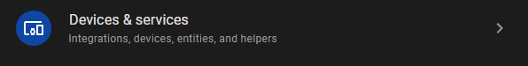
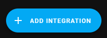
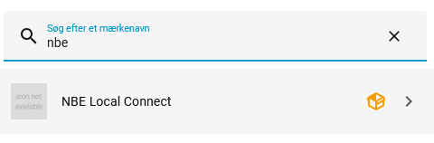
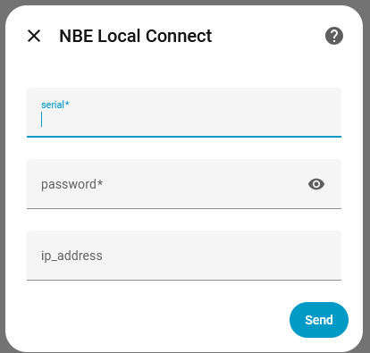
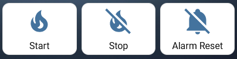
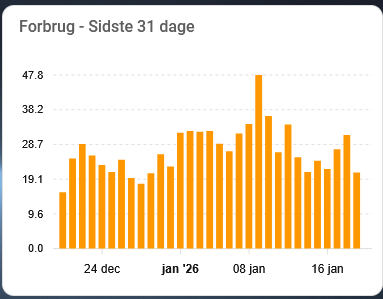

# NBElocalconnect - NBE Pellet Boiler Local Control for Home Assistant

A comprehensive Home Assistant custom integration for NBE pellet boilers that communicates locally via UDP protocol - no cloud dependency required.

## Credits

This integration is based on [NBEConnect](https://github.com/svanggaard/NBEConnect) by [svanggaard](https://github.com/svanggaard), which in turn was based on the [NBE Test program](https://github.com/motoz/nbetest) by [motoz](https://github.com/motoz).

NBElocalconnect represents a complete rewrite and expansion of the original codebase, transforming it from a basic monitoring integration with ~45 manually-defined sensors into a comprehensive control system with 300+ dynamically-discovered entities, write capabilities, and extensive automation support.

## Features

### Core Functionality
- **Direct communication with your boiler - no cloud services required**
- **Dynamic Sensor Discovery**: Automatically discovers and creates 300+ entities based on your controller version
- **Write Services**: Change boiler settings directly from Home Assistant
- **Button Controls**: Start/stop boiler operations and reset alarms
- **Device Discovery**: Automatic detection via UDP broadcast using serial number
- **DHW Consumption Tracking**: Proper time-based sorting of consumption history

### Supported Data Points
- **Operating Data**: Real-time boiler status, temperatures, and operational parameters
- **Advanced Data**: Auger data, oxygen levels, ignition settings
- **Consumption History**: Hourly, daily, monthly, and yearly consumption tracking
- **Settings**: All configurable boiler parameters including weather compensation curves
- **DHW (Domestic Hot Water)**: Consumption tracking and temperature monitoring

### Supported Controllers
- V7
- V10
- V13

*We are hoping for a solution to support V16 controllers in the future.*

## Installation

### Manual Install via HACS

1. Open HACS in your Home Assistant instance
2. Click the three dots (⋮) in the top right corner
3. Select "Custom repositories"
4. Add the repository:
   - **URL**: `https://github.com/Spit68/NBElocalconnect`
   - **Category**: Integration
5. Click "Add"
6. Find "NBE Local Connect" in HACS and install it
7. Restart Home Assistant

## Adding the Integration

### Step 1: Go to Settings → Devices & services



### Step 2: Click + ADD INTEGRATION



### Step 3: Search for "NBE"



### Step 4: Enter Configuration



**Required Fields:**
- **Serial***: Your boiler controller serial number (found on controller label)
- **Password***: Your boiler controller password (found on controller label)

**Optional Field:**
- **IP Address**: Your boiler's IP address
  - Leave empty for automatic discovery via UDP broadcast
  - Or enter a static IP if you've configured one in your router/controller

## Services

The integration provides the following services:

### nbelocalconnect.set_setting
Change boiler settings from Home Assistant.

**Example:**
```yaml
action: nbelocalconnect.set_setting
data:
  entity_id: sensor.nbe_hopper_content
  value: 120
```
*This will set the hopper content to 120 kg.*

### Button Controls
- **Start Boiler**: Starts boiler operation
- **Stop Boiler**: Stops boiler operation  
- **Reset Alarm**: Resets active alarms



**Lovelace Card Example:**
```yaml
type: horizontal-stack
cards:
  - show_name: true
    show_icon: true
    type: button
    entity: button.start_boiler
    name: Start
    icon: mdi:fire
    tap_action:
      action: toggle
  - type: button
    entity: button.stop_boiler
    name: Stop
    icon: mdi:fire-off
    tap_action:
      action: toggle
  - type: button
    entity: button.reset_boiler_alarm
    name: Alarm Reset
    icon: mdi:bell-off
    tap_action:
      action: toggle
```

### Consumption History for 31 days



**Lovelace Card Example (with apexchart)**
```yaml
type: custom:apexcharts-card
header:
  show: true
  title: Forbrug - Sidste 31 dage
graph_span: 31d
series:
  - entity: sensor.nbe_consumption_daily
    type: column
    name: kg
    data_generator: |
      const values = entity.attributes.values;
      if (!values || values.length < 31) return [];

      const result = [];
      const today = new Date();
      today.setHours(0, 0, 0, 0);

      for (let i = 0; i < 31; i++) {
        const date = new Date(today);
        date.setDate(today.getDate() - i);
        result.push([date.getTime(), parseFloat(values[i])]);
      }

      return result;
yaxis:
  - min: 0
    decimals: 1
apex_config:
  tooltip:
    x:
      format: dd MMMM yyyy
```	  

### Automation Example
```yaml
automation:
  - alias: "Heat only when home"
    trigger:
      - platform: state
        entity_id: (your person entity)
        to: "home"
    action:
      - service: button.press
        target:
          entity_id: button.start_boiler
```

## Support

For issues, feature requests, or contributions:
- GitHub Issues: [https://github.com/Spit68/NBElocalconnect/issues](https://github.com/Spit68/NBElocalconnect/issues)

## Acknowledgments

- **motoz**: Original NBE Test program and UDP protocol implementation
- **svanggaard**: NBEConnect v1 Home Assistant integration

## License

GPL-2.0 License - See LICENSE file for details

---

**Note**: This integration communicates directly with your boiler controller using the local network. No data is sent to external cloud services.
