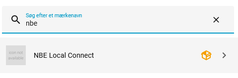
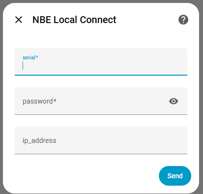
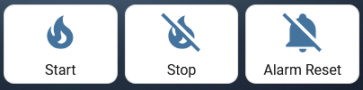
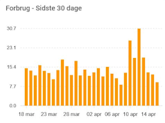
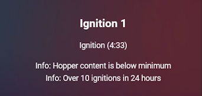
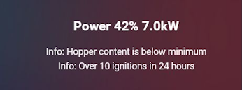
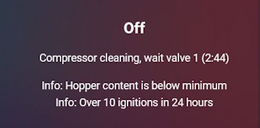
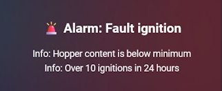

# NBElocalconnect - NBE Pellet Boiler Local Control for Home Assistant

A comprehensive Home Assistant custom integration for NBE pellet boilers that communicates locally via UDP protocol - no cloud dependency required.

## Credits

This integration is based on [NBEConnect](https://github.com/svanggaard/NBEConnect) by [svanggaard](https://github.com/svanggaard), which in turn was based on the [NBE Test program](https://github.com/motoz/nbetest) by [motoz](https://github.com/motoz).

NBElocalconnect represents a complete rewrite and expansion of the original codebase, transforming it from a basic monitoring integration with ~45 manually-defined sensors into a comprehensive control system with 300+ dynamically-discovered entities, write capabilities, and extensive automation support.

## Features

### Core Functionality
- **Direct communication with your boiler - no cloud services required**
- **Dynamic Sensor Discovery**: Automatically discovers and creates 300+ entities based on your controller version
- **Write Services**: Change boiler settings directly from Home Assistant
- **Button Controls**: Start/stop boiler operations and reset alarms
- **Device Discovery**: Automatic detection via UDP broadcast using serial number
- **Backup & Restore**: Save and restore all boiler settings to/from a JSON file
- **DHW Consumption Tracking**: Proper time-based sorting of consumption history

### Supported Data Points
- **Operating Data**: Real-time boiler status, temperatures, and operational parameters
- **Advanced Data**: Auger data, oxygen levels, ignition settings
- **Consumption History**: Hourly, daily, monthly, and yearly consumption tracking
- **Settings**: All configurable boiler parameters including weather compensation curves
- **DHW (Domestic Hot Water)**: Consumption tracking and temperature monitoring

### Status & Info Sensors

The integration provides several pre-built sensors for monitoring boiler status:

- **Alarm Message**: Translated boiler state text (e.g. "Power", "Ignition 1", "Alarm ignition")
- **Substate Message**: Detailed step description during active sequences (e.g. "Ventilates", "Ignition")
- **Info Message Text**: Active info messages from the boiler — supports multiple simultaneous messages
- **Info Message**: Raw info message number(s) from the boiler
- **State Countdown**: Real-time live countdown in seconds for the current boiler step — automatically resets when boiler enters idle states
- **Scan Interval**: Adjustable update interval (10–300 seconds) — set directly in the Home Assistant UI, value is restored after restart

### Multilingual Support

The integration supports multiple languages. Translation files are included for:
- Danish (`da.json`)
- English (`en.json`)

The language is automatically selected based on your Home Assistant language settings and switches dynamically without restart. Contributions for additional languages are welcome — add a new JSON file in the `translations/` folder following the same structure as the existing files.

### Contributing Translations

Want to add your language?

1. Copy `translations/en.json` from the repository
2. Translate all values to your language — keep the `"Info: "` and `"Alarm: "` prefixes in your language
3. Save the file as your language code (e.g. `de.json` for German, `nl.json` for Dutch)
4. Submit a Pull Request on GitHub

You can use [jsoneditoronline.org](https://jsoneditoronline.org) to easily edit the JSON file online before submitting.

### Supported Controllers
- V7
- V10
- V13

*We are hoping for a solution to support V16 controllers in the future.*

## Installation

### Manual Install via HACS

1. Open HACS in your Home Assistant instance
2. Click the three dots (⋮) in the top right corner
3. Select "Custom repositories"
4. Add the repository:
   - **URL**: `https://github.com/Spit68/NBElocalconnect`
   - **Category**: Integration
5. Click "Add"
6. Find "NBE Local Connect" in HACS and install it
7. Restart Home Assistant

## Adding the Integration

### Step 1: Go to Settings → Devices & services


### Step 2: Click + ADD INTEGRATION


### Step 3: Search for "NBE"



### Step 4: Enter Configuration



**Required Fields:**
- **Serial***: Your boiler controller serial number (found on controller label)
- **Password***: Your boiler controller password (found on controller label)

**Optional Field:**
- **IP Address**: Your boiler's IP address
  - Leave empty for automatic discovery via UDP broadcast
  - Or enter a static IP if you've configured one in your router/controller

## Services

The integration provides the following services:

### nbelocalconnect.set_setting
Change boiler settings from Home Assistant.

**Example:**
```yaml
action: nbelocalconnect.set_setting
data:
  entity_id: sensor.nbe_xxxxx_hopper_content
  value: 120
```
*This will set the hopper content to 120 kg.*

where xxxxx is your boiler serial number

### Backup & Restore

The integration includes built-in backup and restore functionality for all boiler settings.

**How it works:**
- Press **Backup Settings** to save all settings to `/config/nbe_backup/backup1_DD-MM-YYYY-HH-MM.json`
- Files are auto-numbered (`backup1_`, `backup2_` etc.) — a new number is assigned for each backup
- Select a backup file in the **Restore — choose backup file** dropdown
- Press **Restore Settings** to write all settings back to the boiler
- Press **Delete Backup** to delete the selected file

**Important notes:**
- Restore writes ~98 settings one by one directly to the boiler and takes approximately 3-4 minutes to complete
- A progress notification updates every 10 settings so you can follow along
- Some sensors may show as unavailable during restore — they will recover at the next poll
- Settings not supported by your boiler (e.g. `lambda_expansion_module` if not installed) will log an error but restore continues without stopping
- It is recommended to keep at least 2 backups of each configuration — backup files are very small (a few KB)

**Tip:** Use backup before firmware updates — restore your settings in minutes instead of entering them manually.

### Button Controls
- **Start Boiler**: Starts boiler operation
- **Stop Boiler**: Stops boiler operation  
- **Reset Alarm**: Resets active alarms



where xxxxx is your boiler serial number

**Lovelace Card Example:**
```yaml
type: horizontal-stack
cards:
  - show_name: true
    show_icon: true
    type: button
    entity: button.nbe_xxxxx_start_boiler
    name: Start
    icon: mdi:fire
    tap_action:
      action: toggle
  - type: button
    entity: button.nbe_xxxxx_stop_boiler
    name: Stop
    icon: mdi:fire-off
    tap_action:
      action: toggle
  - type: button
    entity: button.nbe_xxxxx_reset_boiler_alarm
    name: Alarm Reset
    icon: mdi:bell-off
    tap_action:
      action: toggle
```

### Consumption History for 30 days



where xxxxx is your boiler serial number

**Lovelace Card Example (with apexchart)**
```yaml
type: custom:apexcharts-card
header:
  show: true
  title: Forbrug - Sidste 30 dage
graph_span: 30d
series:
  - entity: sensor.nbe_xxxxx_consumption_daily
    type: column
    name: kg
    data_generator: |
      const values = entity.attributes.values;
      if (!values || values.length < 30) return [];

      const result = [];
      const today = new Date();
      today.setHours(0, 0, 0, 0);

      for (let i = 0; i < 30; i++) {
        const date = new Date(today);
        date.setDate(today.getDate() - i);
        result.push([date.getTime(), parseFloat(values[i])]);
      }

      return result;
yaxis:
  - min: 0
    decimals: 1
apex_config:
  tooltip:
    x:
      format: dd MMMM yyyy
```

where xxxxx is your boiler serial number


### Boiler Info Example
 
 

**Lovelace Card Example**
```yaml
type: markdown
content: >
  <center>   <h2 style="color: red;">🚨 {{
  states('sensor.nbe_xxxxx_alarm_message') }}</h2> 
  <h2>{{ states('sensor.nbe_xxxxx_alarm_message') }} {{
  states('sensor.nbe_xxxxx_power_pct') }}% {{
  states('sensor.nbe_xxxxx_power_kw') }}kW</h2>  <h2>{{
  states('sensor.nbe_xxxxx_alarm_message') }}</h2> 


  {{ states('sensor.nbe_boiler_xxxxx_substate_message') }} ({{ (cd // 60) }}:{{ '%02d' | format(cd % 60) }}) 


  {{ info.replace(' | ', '\n') }} </center>
```

where xxxxx is your boiler serial number


### Automation Example
```yaml
automation:
  - alias: "Heat only when home"
    trigger:
      - platform: state
        entity_id: (your person entity)
        to: "home"
    action:
      - service: button.press
        target:
          entity_id: button.nbe_xxxxx_start_boiler
```

## Support

For issues, feature requests, or contributions:
- GitHub Issues: [https://github.com/Spit68/NBElocalconnect/issues](https://github.com/Spit68/NBElocalconnect/issues)

## Acknowledgments

- **motoz**: Original NBE Test program and UDP protocol implementation
- **svanggaard**: NBEConnect v1 Home Assistant integration

## License

GPL-2.0 License - See LICENSE file for details  
