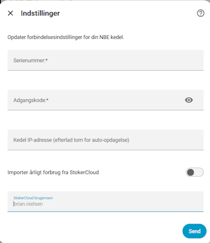
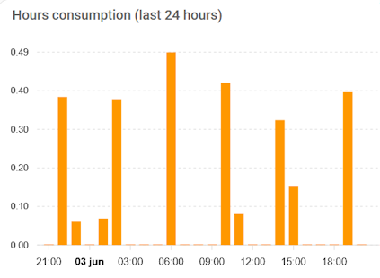
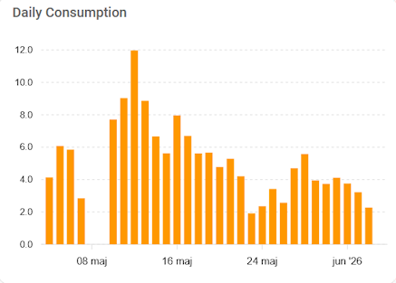
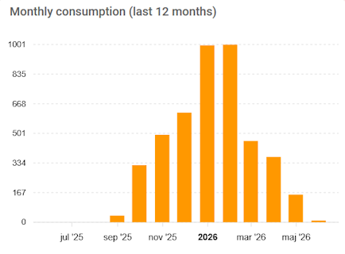
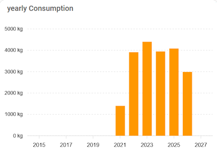

# NBElocalconnect - NBE Pellet Boiler Local Control for Home Assistant

A comprehensive Home Assistant custom integration for NBE pellet boilers that communicates locally via UDP protocol - no cloud dependency required.

## Credits

This integration is based on [NBEConnect](https://github.com/svanggaard/NBEConnect) by [svanggaard](https://github.com/svanggaard), which in turn was based on the [NBE Test program](https://github.com/motoz/nbetest) by [motoz](https://github.com/motoz).

NBElocalconnect represents a complete rewrite and expansion of the original codebase, transforming it from a basic monitoring integration with ~45 manually-defined sensors into a comprehensive control system with 300+ dynamically-discovered entities, write capabilities, and extensive automation support.

## Features

### Core Functionality
- **Direct communication with your boiler - no cloud services required**
- **Dynamic Sensor Discovery**: Automatically discovers and creates 300+ entities based on your controller version
- **Write Services**: Change boiler settings directly from Home Assistant
- **Button Controls**: Start/stop boiler operations and reset alarms
- **Device Discovery**: Automatic detection via UDP broadcast using serial number
- **Backup & Restore**: Save and restore all boiler settings to/from a JSON file
- **Consumption History in HA DB**: Daily and yearly consumption stored in Home Assistant's statistics database — accessible from day one with up to 31 days of historical daily data imported automatically at setup
- **StokerCloud Import**: Optional one-time import of up to 12 years of historical yearly consumption from StokerCloud — runs locally after import
- **Automatic Reconnection**: If the boiler is unreachable at startup, the integration retries automatically without requiring a manual reload

### Supported Data Points
- **Operating Data**: Real-time boiler status, temperatures, and operational parameters
- **Advanced Data**: Auger data, oxygen levels, ignition settings
- **Consumption History**: Hourly, daily, monthly, and yearly consumption tracking — daily and yearly stored in HA statistics database for long-term access
- **Settings**: All configurable boiler parameters including weather compensation curves
- **DHW (Domestic Hot Water)**: Daily and yearly consumption stored in HA statistics database, temperature monitoring

### Status & Info Sensors

The integration provides several pre-built sensors for monitoring boiler status:

- **Alarm Message**: Translated boiler alarm text — includes `alarm_history` attribute with the last 25 alarm events (code, timestamp and translated message)
- **Substate Message**: Detailed step description during active sequences (e.g. "Ventilates", "Ignition")
- **Info Message Text**: Active info messages from the boiler — supports multiple simultaneous messages
- **Info Message**: Raw info message number(s) from the boiler
- **State Countdown**: Real-time live countdown in seconds for the current boiler step — automatically resets when boiler enters idle states
- **Scan Interval**: Adjustable update interval (10–300 seconds) — set directly in the Home Assistant UI, value is restored after restart

### Multilingual Support

The integration supports multiple languages. Translation files are included for:
- Danish (`da.json`)
- English (`en.json`)

The language is automatically selected based on your Home Assistant language settings and switches dynamically without restart. Contributions for additional languages are welcome — add a new JSON file in the `translations/` folder following the same structure as the existing files.

### Contributing Translations

Want to add your language?

1. Copy `translations/en.json` from the repository
2. Translate all values to your language — keep the `"Info: "` and `"Alarm: "` prefixes in your language
3. Save the file as your language code (e.g. `de.json` for German, `nl.json` for Dutch)
4. Submit a Pull Request on GitHub

You can use [jsoneditoronline.org](https://jsoneditoronline.org) to easily edit the JSON file online before submitting.

### Supported Controllers
- V7
- V10
- V13

Due to a firmware bug in V7, V10 and V13 controllers, yearly consumption data stops being stored in the boiler after 2024. NBE has been contacted about this issue but has declined to fix it.

**NBElocalconnect works around this limitation** by tracking yearly consumption locally using delta logic and storing it in Home Assistant's statistics database — completely independent of the boiler's own yearly counter.

## Installation

### Manual Install via HACS

1. Open HACS in your Home Assistant instance
2. Click the three dots (⋮) in the top right corner
3. Select "Custom repositories"
4. Add the repository:
   - **URL**: `https://github.com/Spit68/NBElocalconnect`
   - **Category**: Integration
5. Click "Add"
6. Find "NBE Local Connect" in HACS and install it
7. Restart Home Assistant

## Adding the Integration

### Step 1: Go to Settings → Devices & services


### Step 2: Click + ADD INTEGRATION


### Step 3: Search for "NBE"


### Step 4: Enter Configuration



**Required Fields:**
- **Serial***: Your boiler controller serial number (found on controller label)
- **Password***: Your boiler controller password (found on controller label)

**Optional Fields:**
- **IP Address**: Your boiler's IP address
  - Leave empty for automatic discovery via UDP broadcast
  - Or enter a static IP if you've configured one in your router/controller
- **Import yearly consumption from StokerCloud**: Enable to import up to 12 years of historical consumption data from StokerCloud during setup
  - The toggle automatically turns off after a successful import
  - To re-import (e.g. after a database reset), simply enable the toggle again in reconfiguration
  - **After the import, the integration runs entirely locally — no further cloud contact**
- **StokerCloud username**: Your StokerCloud username (not your email address)

> **Note:** Even without StokerCloud import, yearly and daily consumption is tracked locally from the day the integration is set up.

## Services

The integration provides the following services:

### nbelocalconnect.set_setting
Change boiler settings from Home Assistant.

**Example:**
```yaml
action: nbelocalconnect.set_setting
data:
  entity_id: number.nbe_boiler_xxxxx_hopper_content
  value: 120
```
*This will set the hopper content to 120 kg.*

where xxxxx is your boiler serial number

### Backup & Restore

The integration includes built-in backup and restore functionality for all boiler settings.

**How it works:**
- Press **Backup Settings** to save all settings to `/config/nbe_backup/backup1_DD-MM-YYYY-HH-MM.json`
- Files are auto-numbered (`backup1_`, `backup2_` etc.) — a new number is assigned for each backup
- Select a backup file in the **Restore — choose backup file** dropdown
- Press **Restore Settings** to write all settings back to the boiler
- Press **Delete Backup** to delete the selected file

**Important notes:**
- Restore writes ~98 settings one by one directly to the boiler and takes approximately 3-4 minutes to complete
- A progress notification updates every 10 settings so you can follow along
- Some sensors may show as unavailable during restore — they will recover at the next poll
- Settings not supported by your boiler (e.g. `lambda_expansion_module` if not installed) will log an error but restore continues without stopping
- It is recommended to keep at least 2 backups of each configuration — backup files are very small (a few KB)

**Tip:** Use backup before firmware updates — restore your settings in minutes instead of entering them manually.

### Button Controls
- **Start Boiler**: Starts boiler operation
- **Stop Boiler**: Stops boiler operation
- **Reset Alarm**: Resets active alarms
- **Start Auger 6 min. Weighing Test**: Starts a 6-minute auger weighing test
- **Stop Auger 6 min. Weighing Test**: Stops the auger weighing test

The sensor **Auger Weighing Test Timer** shows a live countdown in seconds during the weighing test.


where xxxxx is your boiler serial number

**Lovelace Card Example:**
```yaml
type: horizontal-stack
cards:
  - show_name: true
    show_icon: true
    type: button
    entity: button.nbe_boiler_xxxxx_start_boiler
    name: Start
    icon: mdi:fire
    tap_action:
      action: toggle
  - type: button
    entity: button.nbe_boiler_xxxxx_stop_boiler
    name: Stop
    icon: mdi:fire-off
    tap_action:
      action: toggle
  - type: button
    entity: button.nbe_boiler_xxxxx_reset_boiler_alarm
    name: Alarm Reset
    icon: mdi:bell-off
    tap_action:
      action: toggle
```


### Consumption History for last 24 hours



Where `xxxxx` is your boiler serial number.


**Lovelace Card Example (with apexcharts-card)**
```yaml
type: custom:apexcharts-card
header:
  show: true
  title: Consumption (last 24 hours)
graph_span: 24h
series:
  - entity: sensor.nbe_boiler_xxxxx_consumption_hourly
    type: column
    name: kg/hour
    data_generator: |
      const values = entity.attributes.values;
      if (!values || values.length < 24) return [];
      const result = [];
      const now = new Date();
      now.setMinutes(0, 0, 0);
      for (let i = 0; i < 24; i++) {
        const date = new Date(now);
        date.setHours(now.getHours() - i);
        result.push([date.getTime(), parseFloat(values[i])]);
      }
      return result;
yaxis:
  - min: 0
    decimals: 2
```


### Consumption History for 31 days (or more)

The history is stored in Home Assistant's statistics database and can be kept for years.
On first setup, up to 31 days of historical data is automatically imported from the boiler.



Where `xxxxx` is your boiler serial number.

**Lovelace Card Example from entity (with apexcharts-card)**
```yaml
type: custom:apexcharts-card
header:
  show: true
  title: Daily consumption
graph_span: 31d
apex_config:
  annotations:
    position: front
  tooltip:
    x:
      format: dd MMMM yyyy
series:
  - entity: sensor.nbe_boiler_xxxxx_consumption_daily
    type: column
    name: kg
    data_generator: |
      const values = entity.attributes.values;
      if (!values || values.length < 31) return [];
      const result = [];
      const today = new Date();
      today.setHours(0, 0, 0, 0);
      for (let i = 0; i < 31; i++) {
        const date = new Date(today);
        date.setDate(today.getDate() - i);
        result.push([date.getTime(), parseFloat(values[i])]);
      }
      return result;
yaxis:
  - min: 0
    decimals: 1
```

**Lovelace Card Example from Home assistant database (with apexcharts-card)**
```yaml
type: custom:apexcharts-card
graph_span: 31d
span:
  end: day
header:
  show: true
  title: Daily Consumption
  show_states: false
apex_config:
  tooltip:
    x:
      format: dd MMM yyyy
  yaxis:
    labels:
      formatter: |
        EVAL:function(value) {
          return value.toFixed(0) + ' kg';
        }      
series:
  - entity: sensor.nbe_boiler_xxxxx_consumption_daily
    name: Daily Consumption
    type: column
    unit: kg
    data_generator: |
      const stat_id = 'nbelocalconnect:pellets_daily_xxxxx';

      const result = await hass.callWS({
        type: 'recorder/statistics_during_period',
        start_time: new Date(start).toISOString(),
        end_time: new Date(end).toISOString(),
        statistic_ids: [stat_id],
        period: 'day'
      });

      const stats = result[stat_id] || [];
      return stats.map((row) => {
        return [new Date(row.start).getTime(), row.state ?? 0];
      });
```


### Consumption History for last 12 months



Where `xxxxx` is your boiler serial number.


**Lovelace Card Example (with apexcharts-card)**
```yaml
type: custom:apexcharts-card
header:
  show: true
  title: Monthly Consumption (last 12 months)
graph_span: 12month
apex_config:
  chart:
    height: 300px
  tooltip:
    x:
      format: MMMM yyyy
series:
  - entity: sensor.nbe_boiler_xxxxx_consumption_monthly
    type: column
    name: kg/month
    data_generator: |
      const values = entity.attributes.values;
      if (!values || values.length < 12) return [];
      const result = [];
      const now = new Date();
      for (let i = 0; i < 12; i++) {
        const date = new Date(now.getFullYear(), now.getMonth() - i, 1);
        result.push([date.getTime(), parseFloat(values[i])]);
      }
      return result;
yaxis:
  - min: 0
    decimals: 0
```


### Yearly Consumption History

The history is imported from StokerCloud during setup or reconfiguration, if import is enabled.
After that, the integration keeps the yearly consumption data up to date locally.

The data is stored in Home Assistant's statistics database and can be kept for years.



Where `xxxxx` is your boiler serial number.

**Lovelace Card Example from entity (with apexcharts-card)**
```yaml
type: custom:apexcharts-card
header:
  show: true
  title: Yearly consumption
graph_span: 12y
apex_config:
  annotations:
    position: front
  chart:
    height: 300px
  tooltip:
    x:
      format: yyyy
series:
  - entity: sensor.nbe_boiler_xxxxx_consumption_yearly
    type: column
    name: kg/year
    data_generator: |
      const values = entity.attributes.values;
      if (!values || values.length < 12) return [];
      const result = [];
      const now = new Date();
      for (let i = 0; i < 12; i++) {
        const date = new Date(now.getFullYear() - i, 0, 1);
        result.push([date.getTime(), parseFloat(values[i])]);
      }
      return result;
yaxis:
  - min: 0
    decimals: 0
```

**Lovelace Card Example from home assistant database (with apexcharts-card)**
```yaml
type: custom:apexcharts-card
graph_span: 12y
span:
  end: year
header:
  show: true
  title: Yearly Consumption
  show_states: false
apex_config:
  tooltip:
    x:
      format: yyyy
  yaxis:
    labels:
      formatter: |
        EVAL:function(value) {
          return value.toFixed(0) + ' kg';
        }
series:
  - entity: sensor.nbe_boiler_xxxxx_consumption_yearly
    name: Yearly Consumption
    type: column
    unit: kg
    data_generator: |
      const stat_id = 'nbelocalconnect:pellets_yearly_xxxxx';

      const result = await hass.callWS({
        type: 'recorder/statistics_during_period',
        start_time: new Date(start).toISOString(),
        end_time: new Date(end).toISOString(),
        statistic_ids: [stat_id],
        period: 'year'
      });

      const stats = result[stat_id] || [];
      return stats.map((row) => {
        return [new Date(row.start).getTime(), row.state ?? 0];
      });
```


### Coming Soon

**Month Comparison**: An example card comparing the same month across different years (e.g. May 2025 vs May 2026) will be added once enough historical data is available.

---

### Boiler Info Example
 
 

Where `xxxxx` is your boiler serial number.

**Lovelace Card Example**
```yaml
type: markdown
content: >
  <center>

  
  
  
  
  

  

  <h2 style="color:#FF4560">🚨 {{ alarm }}</h2>

  

  <h2 style="color:#00E676">🔥 {{ alarm }} - {{
  states('sensor.nbe_boiler_xxxxx_power_pct') }}% / {{
  states('sensor.nbe_boiler_xxxxx_power_kw') }} kW</h2>

  

  <h2>{{ alarm }}</h2>

  

  {{ sub }} ({{ cd // 60 }}:{{ '%02d' | format(cd % 60) }})

  


  {{ info.replace(' | ', '

  ') }}

  </center>

```


### Automation Example
```yaml
automation:
  - alias: "Heat only when home"
    trigger:
      - platform: state
        entity_id: (your person entity)
        to: "home"
    action:
      - service: button.press
        target:
          entity_id: button.nbe_boiler_xxxxx_start_boiler
```

## Support

For issues, feature requests, or contributions:
- GitHub Issues: [https://github.com/Spit68/NBElocalconnect/issues](https://github.com/Spit68/NBElocalconnect/issues)

## Acknowledgments

- **motoz**: Original NBE Test program and UDP protocol implementation
- **svanggaard**: NBEConnect v1 Home Assistant integration

## License

GPL-2.0 License - See LICENSE file for details
